# BIMOps AI

BIMOps AI is a Revit-to-Databricks lakehouse prototype that turns BIM schedule exports into structured analytics tables, dashboard metrics, and BIM data quality checks.

The project uses Autodesk Revit sample model data, Python, and Databricks to demonstrate how BIM metadata can move from design files into a modern data workflow:

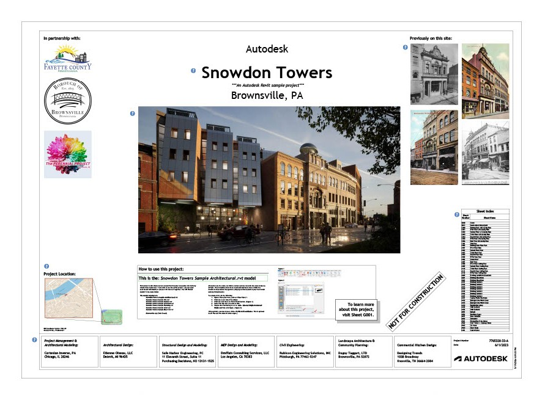

```text
Revit schedules -> Bronze raw tables -> Silver cleaned tables -> Gold analytics tables -> Dashboard insights
```

## Project Goal

Most BIM data is rich but difficult to analyze outside authoring tools. This project shows how Revit metadata can be extracted into tabular schedules, standardized, loaded into a Databricks-style medallion architecture, and transformed into dashboard-ready building intelligence.

The focus is not just loading CSV files. The project demonstrates how BIM data can support:

- Cross-discipline model inventory
- Building program analytics
- MEP and structural asset summaries
- Life-safety and envelope checks
- Metadata completeness review
- BIM readiness scoring for downstream analytics and AI querying

## Source Model

The BIM data comes from Autodesk's Snowdon Towers Revit sample project.

Source: [Autodesk Revit 2024 sample project documentation](https://help.autodesk.com/view/RVT/2024/ENU/?guid=GUID-61EF2F22-3A1F-4317-B925-1E85F138BE88)

Large Revit model files are not committed to this repository. Only exported schedule CSVs, code, notebooks, documentation, and screenshots are included.

## Dashboard Preview

### LinkedIn Project Poster

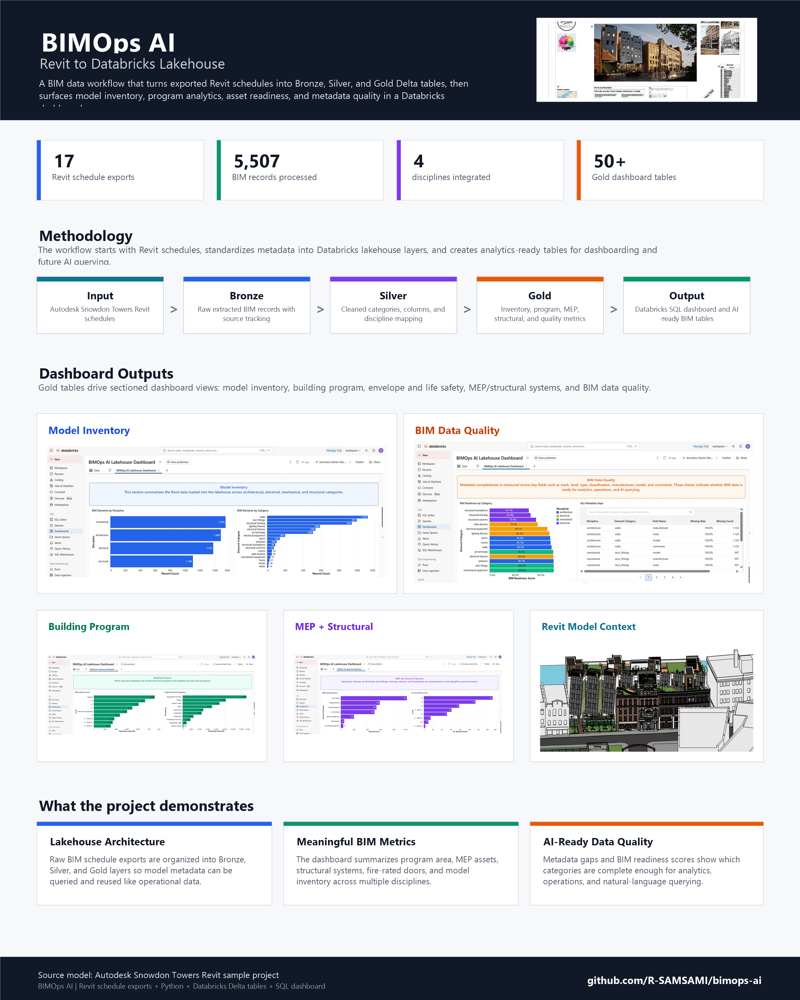

### Dashboard Overview

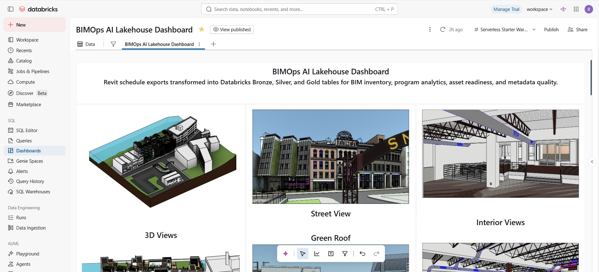

### Model Inventory

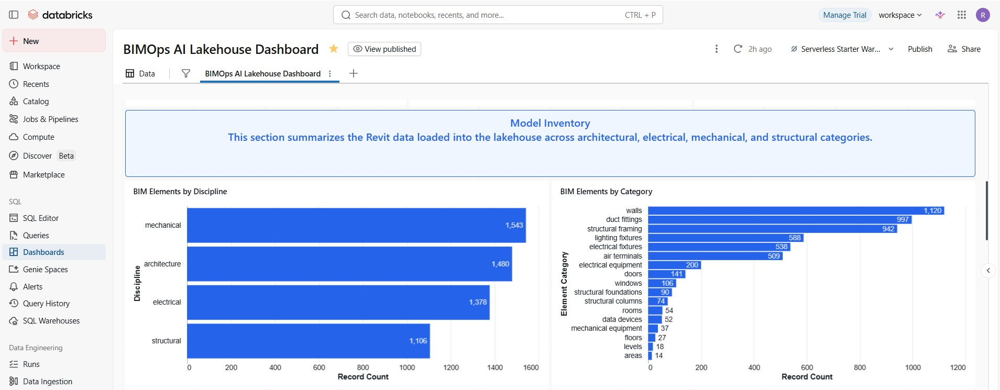

### Building Program

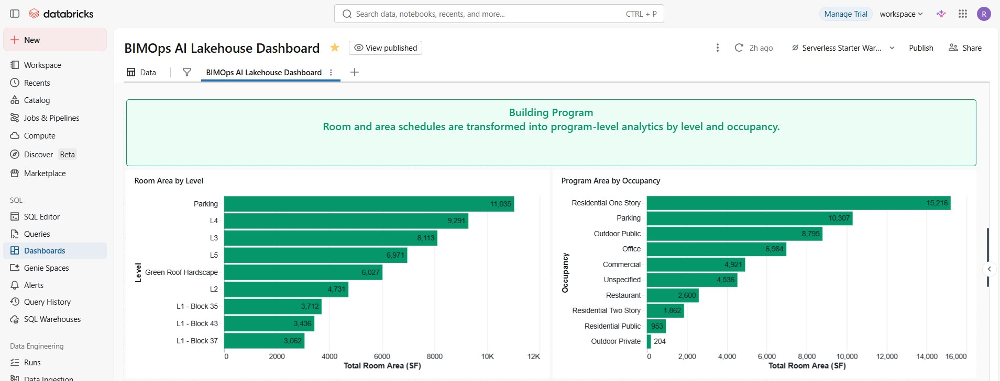

### Envelope and Life Safety

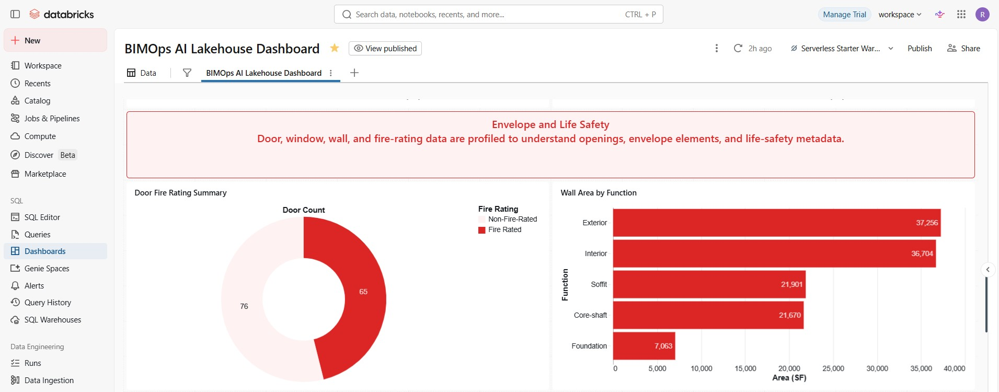

### MEP and Structural Systems

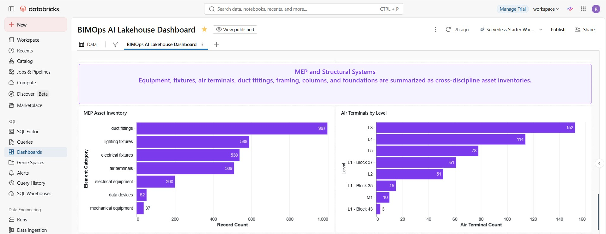

### BIM Data Quality

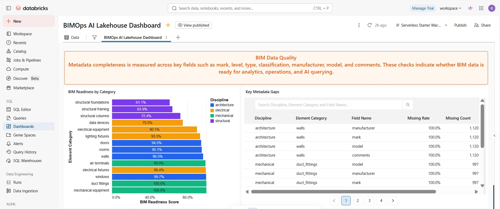

### Lakehouse Governance

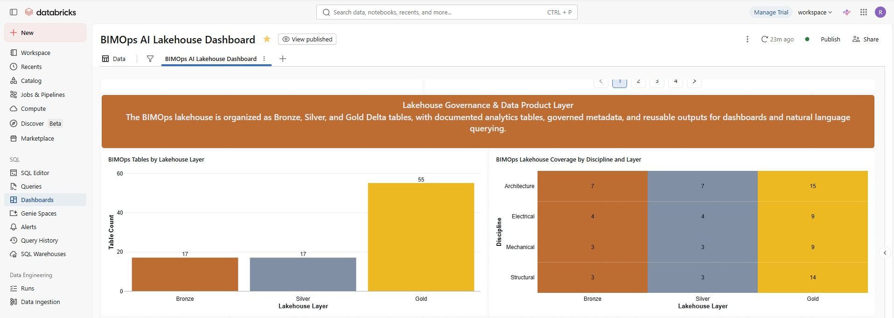

## Revit Model Context

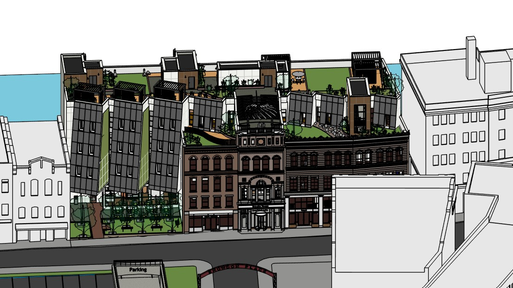

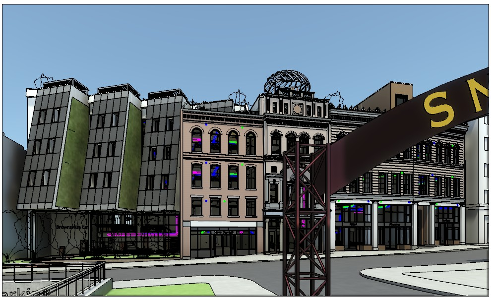

## Methodology

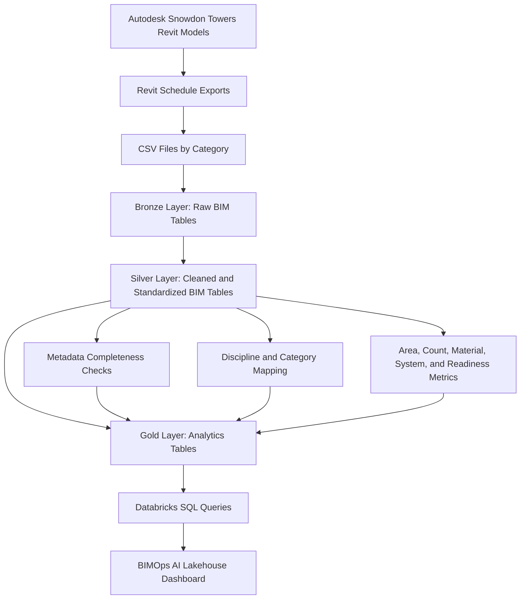

## Data Extracted

The current dataset contains 17 Revit schedule exports across architectural, electrical, mechanical, and structural categories.

| Export | Lakehouse Category | Discipline |
| --- | --- | --- |
| `rooms.csv` | `rooms` | Architecture |
| `areas.csv` | `areas` | Architecture |
| `doors.csv` | `doors` | Architecture |
| `window.csv` | `windows` | Architecture |
| `walls.csv` | `walls` | Architecture |
| `floors.csv` | `floors` | Architecture |
| `levels.csv` | `levels` | Architecture |
| `eequipment.csv` | `electrical_equipment` | Electrical |
| `efixtures.csv` | `electrical_fixtures` | Electrical |
| `lfixtures.csv` | `lighting_fixtures` | Electrical |
| `datadevices.csv` | `data_devices` | Electrical |
| `airterminals.csv` | `air_terminals` | Mechanical |
| `ductfittings.csv` | `duct_fittings` | Mechanical |
| `mequipment.csv` | `mechanical_equipment` | Mechanical |
| `scolumns.csv` | `structural_columns` | Structural |
| `sfoundations.csv` | `structural_foundations` | Structural |
| `sframings.csv` | `structural_framing` | Structural |

## Current Model Inventory

The processed dataset contains thousands of BIM records across four disciplines.

| Discipline | Record Count |
| --- | ---: |
| Mechanical | 1,543 |
| Architecture | 1,480 |
| Electrical | 1,378 |
| Structural | 1,106 |

Largest categories include:

| Category | Record Count |
| --- | ---: |
| Walls | 1,120 |
| Duct fittings | 997 |
| Structural framing | 942 |
| Lighting fixtures | 588 |
| Electrical fixtures | 538 |
| Air terminals | 509 |

## Lakehouse Layers

### Bronze

Bronze tables preserve raw Revit schedule records after basic CSV parsing. Each record includes source tracking fields:

- `source_file`
- `source_system`

Example tables:

```text
bronze_rooms
bronze_doors
bronze_walls
bronze_electrical_equipment
bronze_air_terminals
bronze_structural_framing
```

### Silver

Silver tables clean and standardize the BIM schedules:

- Normalize column names to SQL-friendly snake case
- Drop duplicate rows
- Add normalized `element_category`
- Map short Revit export filenames to readable categories

Example mappings:

```text
eequipment.csv    -> electrical_equipment
lfixtures.csv     -> lighting_fixtures
airterminals.csv  -> air_terminals
sframings.csv     -> structural_framing
window.csv        -> windows
```

### Gold

Gold tables are dashboard-ready analytics outputs.

Key Gold tables include:

```text
gold_model_inventory_by_discipline
gold_model_inventory_by_category
gold_room_area_by_level
gold_program_area_by_occupancy
gold_mep_inventory_summary
gold_structural_inventory_summary
gold_bim_readiness_score
gold_key_field_completeness
gold_asset_identity_readiness
gold_metadata_quality
```

## Professional Data Product Documentation

Additional project documentation expands the prototype beyond dashboards into a stakeholder-ready AEC data product:

- [Data Dictionary](docs/data_dictionary.md): plain-language definitions for Gold tables, columns, metrics, and example questions.
- [Data Governance](docs/data_governance.md): source traceability, ownership model, quality rules, refresh cadence, limitations, and AI query governance.
- [Stakeholder Use Cases](docs/stakeholder_use_cases.md): how BIM managers, designers, project managers, MEP teams, structural teams, owner/facilities teams, and data teams can use the lakehouse.
- [AI Query Layer](docs/ai_query_layer.md): architecture and safety design for natural-language querying over governed Gold tables.
- [Dashboard Spec](docs/dashboard_spec.md): dashboard layout and visual design plan.
- [Databricks Quickstart](docs/databricks_quickstart.md): steps for running the project inside Databricks.

## Dashboard Sections

### 1. Model Inventory

Shows the full scope of BIM data loaded into the lakehouse.

Metrics:

- Record count by discipline
- Record count by Revit category
- Largest BIM categories by row count

### 2. Building Program

Turns room and area schedules into planning analytics.

Metrics:

- Room area by level
- Program area by occupancy
- Room count by occupancy
- Finish metadata completeness

### 3. Envelope and Life Safety

Profiles doors, windows, walls, and fire-rating metadata.

Metrics:

- Door count by level
- Fire-rated vs non-fire-rated door count
- Wall area by function
- Window count by level

### 4. MEP and Structural Systems

Summarizes cross-discipline asset inventories.

Metrics:

- MEP assets by category
- Air terminals by level
- Electrical equipment by level and part type
- Structural framing, columns, and foundations by type/material

### 5. BIM Data Quality

Measures whether BIM metadata is complete enough for analytics, operations, and AI workflows.

Metrics:

- BIM readiness score by category
- Key metadata gaps
- Missing `mark`, `level`, `type`, `classification`, `manufacturer`, `model`, and `comments`
- Asset identity readiness

## BIM Readiness Score

The readiness score measures completion of important fields for each category. For example:

- Rooms: number, name, level, area, occupancy, finish fields
- Doors: type, level, family, fire rating, width, height, material
- Equipment: mark, family/type, level, system, electrical/mechanical metadata
- Structural elements: material, level, usage, volume, type

The score is calculated as:

```text
1 - missing important values / total important values
```

This turns BIM metadata quality into a measurable, dashboard-ready metric.

## Repository Structure

```text
BIMOps-AI/
  data/
    bronze/                  Local generated Bronze output placeholder
    silver/                  Local generated Silver output placeholder
    gold/                    Local generated Gold output placeholder
  docs/
    dashboard_spec.md         Dashboard design and chart plan
    databricks_quickstart.md  Databricks setup instructions
    full_project_plan.md      Expanded extraction and metric roadmap
    revit_export_guide.md     Revit schedule export guide
  exports/
    revit_schedules/          Exported Revit schedule CSVs
  app/
    app.py                    Streamlit Databricks App for BIMOps Copilot
    app.yaml                  Databricks Apps startup command
    requirements.txt          App dependencies
  notebooks/
    databricks_bimops_starter.py
    ask_bim_lakehouse_openai.py
    bimops_copilot_assistant.py
  screenshots/
    dashboard*.jpg            Databricks dashboard screenshots
    *.jpg                     Revit model screenshots
  src/
    bimops/
      pipeline.py             Local Bronze/Silver/Gold pipeline
  requirements.txt
```

## Run Locally

Install dependencies:

```powershell
python -m pip install -r requirements.txt
```

Run the local medallion pipeline:

```powershell
python src\bimops\pipeline.py
```

The local pipeline writes CSV and Parquet outputs to:

```text
data/bronze/
data/silver/
data/gold/
```

Generated data outputs are ignored by Git except for placeholder `.gitkeep` files.

## Run In Databricks

1. Upload the CSV exports to a Unity Catalog volume:

```text
/Volumes/workspace/default/bimops_raw
```

2. Import the notebook:

```text
notebooks/databricks_bimops_starter.py
```

3. Run the notebook cells in order.

4. Query the Gold tables from Databricks SQL.

5. Build the dashboard using the Gold tables.

Detailed Databricks steps are in [docs/databricks_quickstart.md](docs/databricks_quickstart.md).

## BIMOps Copilot Databricks App

The project also includes a Streamlit app for Databricks Apps:

```text
app/
```

The app provides a chat-style interface for asking BIM lakehouse questions, previewing the generated SQL, reviewing Databricks query results, and receiving a plain-English answer with recommended next actions.

Required app configuration:

```text
OPENAI_API_KEY
DATABRICKS_SERVER_HOSTNAME
DATABRICKS_HTTP_PATH
DATABRICKS_TOKEN
```

Optional:

```text
BIMOPS_DATABASE=bimops_ai
```

See [app/README.md](app/README.md) for deployment notes.

## Ask The BIM Lakehouse With OpenAI

The project also includes an optional Databricks notebook for natural-language querying:

```text
notebooks/ask_bim_lakehouse_openai.py
notebooks/bimops_copilot_assistant.py
```

The first notebook demonstrates a lightweight question-to-SQL workflow. The Copilot notebook expands that into an assistant-style experience: it discovers the available Gold tables, generates safe read-only SQL, runs the query in Databricks, summarizes the result, and recommends a practical BIM/data-quality next action.

Example questions:

```text
Which BIM categories have the weakest readiness scores?
Which fields have the worst metadata completeness?
Which level has the most room area?
How many doors are fire-rated versus non-fire-rated?
```

Keep API keys private. Add your OpenAI key through the notebook widget or a Databricks secret, not in GitHub.

### AI Query Demo

The repository includes a short recording of the natural-language BIM query workflow:

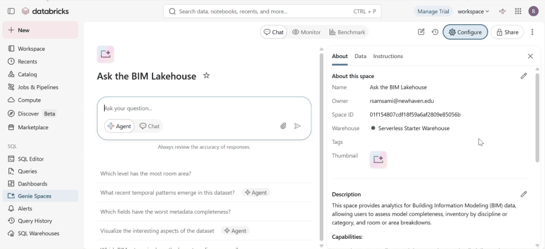

The demo shows how a user can ask a BIM lakehouse question, generate SQL over Gold tables, execute the query in Databricks, and receive a plain-English answer for AEC stakeholders.

## Example SQL

```sql
SELECT *
FROM bimops_ai.gold_model_inventory_by_discipline
ORDER BY record_count DESC;
```

```sql
SELECT *
FROM bimops_ai.gold_room_area_by_level
ORDER BY total_room_area_sf DESC;
```

```sql
SELECT *
FROM bimops_ai.gold_bim_readiness_score
ORDER BY bim_readiness_score ASC;
```

```sql
SELECT discipline, element_category, field_name, missing_rate, missing_count, total_records
FROM bimops_ai.gold_key_field_completeness
WHERE missing_rate > 0
ORDER BY missing_rate DESC, missing_count DESC;
```

## Notes

- Revit model files are excluded because they are large binary assets.
- The CSV exports are included so the pipeline and notebook can be reviewed and reproduced.
- The Databricks dashboard itself is represented through screenshots because hosted Databricks dashboard links may require workspace authentication.
