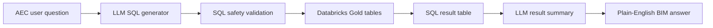

# AI Query Layer

The AI query layer extends BIMOps AI from a dashboard project into a conversational BIM data product.

## Concept



## Why This Matters

BIM stakeholders often need answers from model data but may not know:

- Revit parameter names
- SQL syntax
- Which schedule contains the answer
- How to interpret raw tabular outputs

The AI query layer gives them a more natural interface:

```text
Which BIM categories have the weakest readiness scores?
Which level has the most room area?
Which MEP asset categories have the most records?
Which fields have the worst metadata completeness?
How many doors are fire-rated versus non-fire-rated?
```

## Current Implementation

Notebook:

```text
notebooks/ask_bim_lakehouse_openai.py
```

Workflow:

1. User enters an OpenAI API key through a Databricks widget or Databricks secret.
2. User enters a natural-language BIM question.
3. The notebook provides the LLM with Gold table names, descriptions, and schemas.
4. The LLM generates a Databricks SQL `SELECT` query.
5. The notebook validates the SQL.
6. Databricks executes the query.
7. The LLM summarizes the result for an AEC stakeholder.

## Safety Design

The notebook includes basic SQL safety controls:

- Only `SELECT` statements are allowed.
- Write/destructive keywords are blocked.
- Generated SQL must query Gold tables.
- The AI receives curated Gold table context rather than raw model files.

Blocked SQL actions include:

```text
INSERT
UPDATE
DELETE
DROP
ALTER
CREATE
MERGE
TRUNCATE
GRANT
REVOKE
```

## Gold Tables Used By The AI Layer

- `gold_model_inventory_by_discipline`
- `gold_model_inventory_by_category`
- `gold_bim_readiness_score`
- `gold_key_field_completeness`
- `gold_room_area_by_level`
- `gold_program_area_by_occupancy`
- `gold_mep_inventory_summary`
- `gold_structural_inventory_summary`
- `gold_door_fire_rating_summary`
- `gold_asset_identity_readiness`

## Databricks Genie Note

Databricks Genie is a natural fit because it is designed for natural-language analytics over governed data.

In this prototype, Genie was explored first. The trial workspace returned a Foundation Model access error:

```text
Pay-per-token for this model is disabled.
```

Because of that platform limitation, the project includes an OpenAI-powered Databricks notebook as a fallback architecture.

This still demonstrates the core pattern:

```text
governed Gold tables + natural-language question + SQL generation + stakeholder-friendly answer
```

## Future Enhancements

- Add Databricks secret scope setup instructions.
- Add a curated semantic layer with approved question/table mappings.
- Connect to Databricks Genie when Foundation Model access is available.
- Package the workflow as a Databricks App for a cleaner user interface.

